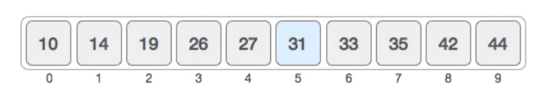
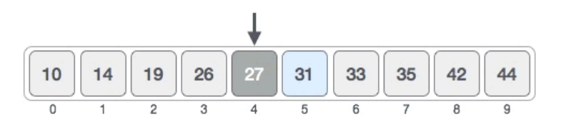
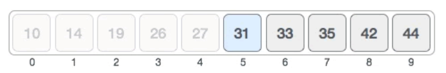
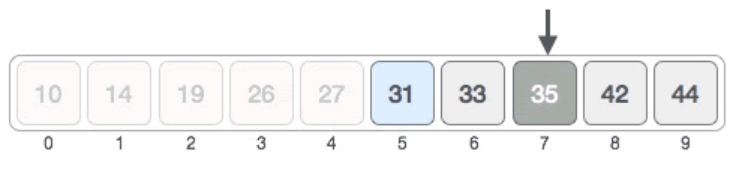
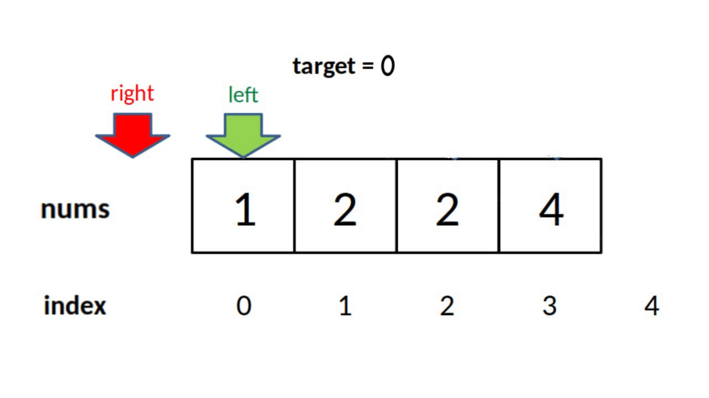
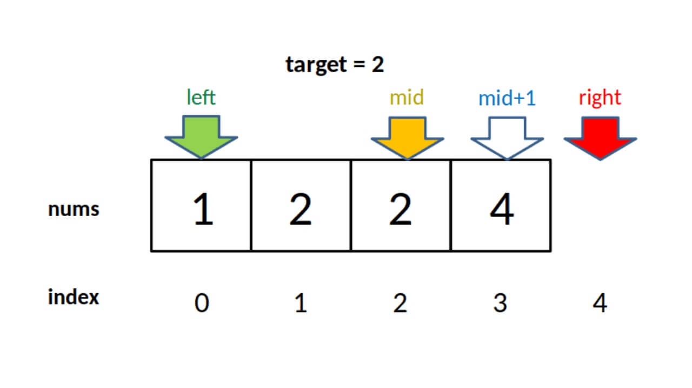

# 二分查找算法

二分查找又称折半查找、二分搜索、折半搜索，它是基于分治算法的搜索方法。
__*二分查找仅适用于有序序列*__

## 思路

在有序序列中，使用二分查找算法搜索目标元素的核心思想是：不断地缩小搜索区域，降低查找目标元素的难度。

以在升序序列中查找目标元素为例，二分查找算法的实现思路是：

1. 初始状态下，将整个序列作为搜索区域（假设为 [B, E]）；
2. 找到搜索区域内的中间元素（假设所在位置为 M），和目标元素进行比对。如果相等，则搜索成功；如果中间元素大于目标元素，表明目标元素位于中间元素的左侧，将 [B, M-1] 作为新的搜素区域；反之，若中间元素小于目标元素，表明目标元素位于中间元素的右侧，将 [M+1, E] 作为新的搜素区域；
3. 重复执行第二步，直至找到目标元素。如果搜索区域无法再缩小，且区域内不包含任何元素，表明整个序列中没有目标元素，查找失败。

举个简单的例子，在下图所示的升序序列中查找元素 31。



二分查找算法的具体实现过程为：
1. 初始状态下，搜索区域是整个序列。找到搜索区域内的中间元素。指定区域内中间元素的位置可以套用如下公式求出：
```
mid=begin+(end-begin)/2
```
> End 表示搜索区域内最后一个元素所在位置，Begin 表示搜索区域内第一个元素所在的位置，Mid 表示中间元素所在的位置。

图 1 中，所有元素的位置分别用 0~9 表示，中间元素的位置为 0 + (9 - 0) / 2  = 4，如下图所示：



中间元素 27 < 31，可以断定 [0, 4] 区域内绝对没有 31，目标元素只可能位于 [5, 9] 区域内，如下图所示：



2. 在 [5, 9] 区域内，中间元素的位置为 5 + (9 - 5) / 2 = 7，如下图所示：



中间元素 35 > 31，可以断定 [7, 9] 区域内绝对没有 31，目标元素只可能位于 [5,6] 中，如下图所示：


3. 在 [5, 6] 区域内，中间元素的位置为 5 + (6- 5) / 2 = 5，中间元素就是 31，成功找到目标元素。


## 模板

```c
int binary_search(int[] nums, int target) {
    int left = 0, right = nums.length - 1; 
    while(left <= right) {
        int mid = left + (right - left) / 2;
        if (nums[mid] < target) {
            left = mid + 1;
        } else if (nums[mid] > target) {
            right = mid - 1; 
        } else if(nums[mid] == target) {
            // 直接返回
            return mid;
        }
    }
    // 直接返回
    return -1;
}

int left_bound(int[] nums, int target) {
    int left = 0, right = nums.length - 1;
    while (left <= right) {
        int mid = left + (right - left) / 2;
        if (nums[mid] < target) {
            left = mid + 1;
        } else if (nums[mid] > target) {
            right = mid - 1;
        } else if (nums[mid] == target) {
            // 别返回，锁定左侧边界
            right = mid - 1;
        }
    }
    // 最后要检查 left 越界的情况
    if (left >= nums.length || nums[left] != target)
        return -1;
    return left;
}

int right_bound(int[] nums, int target) {
    int left = 0, right = nums.length - 1;
    while (left <= right) {
        int mid = left + (right - left) / 2;
        if (nums[mid] < target) {
            left = mid + 1;
        } else if (nums[mid] > target) {
            right = mid - 1;
        } else if (nums[mid] == target) {
            // 别返回，锁定右侧边界
            left = mid + 1;
        }
    }
    // 最后要检查 right 越界的情况
    if (right < 0 || nums[right] != target)
        return -1;
    return right;
}
```

## 具体实现

用二分查找算法在 {10, 14, 19, 26, 27, 31, 33, 35, 42, 44} 升序序列中查找元素 31：
```c
#include <stdio.h>
//实现二分查找算法，ele 表示要查找的目标元素，[p,q] 指定查找区域
int binary_search(int *arr,int p,int q,int ele) {
    int mid = 0;
    //如果[p,q] 不存在，返回 -1
    if (p > q) {
        return -1;
    }
    // 找到中间元素所在的位置
    mid = p + (q - p) / 2;
    //递归的出口
    if (ele == arr[mid]) {
        return mid;
    }
    //比较 ele 和 arr[mid] 的值，缩小 ele 可能存在的区域
    if (ele < arr[mid]) {
        //新的搜索区域为 [p,mid-1]
        return binary_search(arr, p, mid - 1, ele);
    }
    else {
        //新的搜索区域为 [mid+1,q]
        return binary_search(arr, mid + 1, q, ele);
    }
}

int main()
{
    int arr[10] = { 10,14,19,26,27,31,33,35,42,44 };
    //输出二叉查找元素 31 所在位置的下标
    printf("%d", binary_search(arr, 0, 9, 31));
    return 0;
}
```

## 难点

二分查找的难点在于mid加一还是减一，while中使用<=还是<

### 根据搜索区间分类

1. 区间为[left, right]

 right = nums.length - 1

​ while (left <= right)

​ left = mid+1 和 right = mid-1

2. 区间为[left, right)

​ right = nums.length

​ while (left < right)

​ left = mid+1 和 right = mid

### 根据搜索目的分类

1. 找到一个target的索引

​ 当 nums[mid] == target 时可以立即返回

2. 找到 target 的最左侧索引

​当 nums[mid] == target 时不要立即返回 而要收紧右侧边界以锁定左侧边界

3. 找到 target 的最右侧索引

当 nums[mid] == target 时不要立即返回 而要收紧左侧边界以锁定右侧边界

> 当搜索区间是闭区间时，在寻找边界的时候，由于返回条件是left = mid+1 和 right = mid-1 ，可能会在特殊的输入值下出现数组越界的情况，需要排除。如下图所示。
>
> 
> 


参考： [二分搜索算法](http://c.biancheng.net/algorithm/binary-search.html)
[二分搜索算法总结](https://blog.csdn.net/bigem/article/details/123012151?spm=1001.2101.3001.6650.2&utm_medium=distribute.pc_relevant.none-task-blog-2%7Edefault%7ECTRLIST%7ERate-2.pc_relevant_antiscanv2&depth_1-utm_source=distribute.pc_relevant.none-task-blog-2%7Edefault%7ECTRLIST%7ERate-2.pc_relevant_antiscanv2&utm_relevant_index=5)