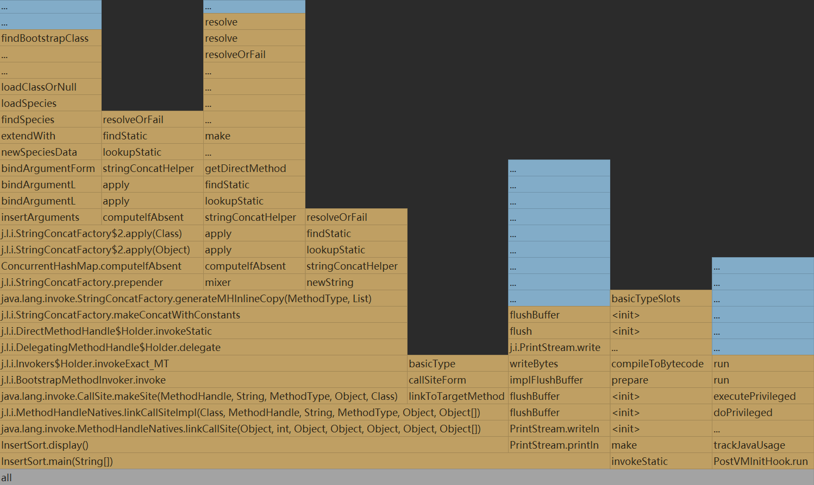
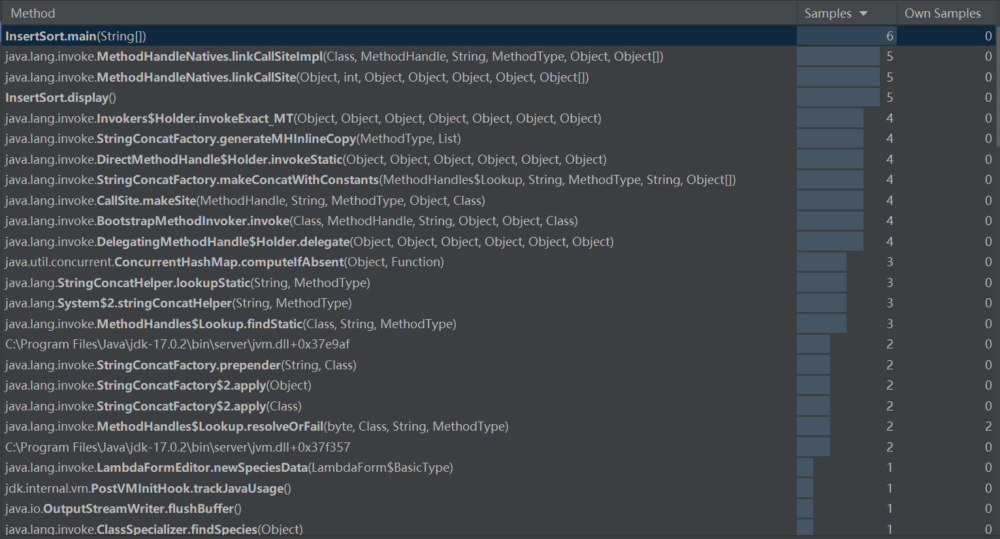
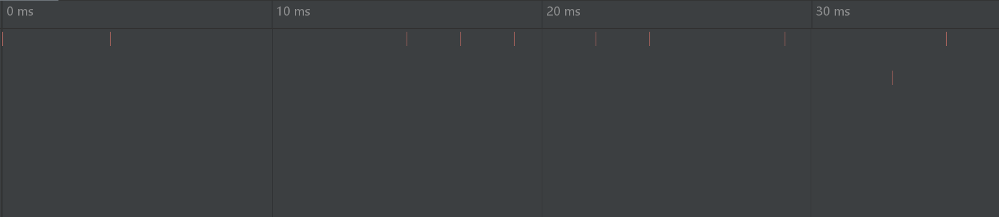

# 插入排序的性能分析

## profiler分析

### Flame Graph

火焰图使用代表调用堆栈框架的矩形可视化应用程序调用树，按宽度排序。消耗更多 CPU 时间和内存资源的方法比其他方法更广泛。其中蓝色代表本机调用，黄色代表Java调用。最宽的块是配置文件中呈现最多的方法。

每个块表示堆栈中的一个函数（堆栈帧）。每个块的宽度对应于方法的 CPU 时间或使用的内存（或分配大小，在分配分析的情况下）

在 Y 轴上，有一个自下而上的堆栈深度。X 轴显示堆栈配置文件，从最消耗资源的函数排序到消耗最少的函数。

由下图所示，最消耗资源的函数为insertSort，其次是insertSort.display、java.lang.invoke.MethodHandleNatives.linkCallSite以及j.l.i.MethodHandleNatives.linkCallSitelmpl，最不消耗资源的函数为findBootstrapClass。



### 调用树

调用树显示有关在分析过程中采样的程序调用堆栈的信息。

由图可知，insertSort中调用堆栈最多的为insertSort.display中的java.lang.invoke.MethodHandleNAtives下的java.lang.invoke.CallSite.makeSite


### 方法列表

方法列表收集分析数据中的所有方法，并按累积采样时间对它们进行排序。



### 时间线

可视化了一段时间内的 CPU 消耗和内存分配，这有助于识别关键点和不正确的行为。



## java代码

```java
public class InsertSort {
    private int[] array;
    private int length;

       public InsertSort(int[] array){
        this.array = array;
        this.length = array.length;
    }

    public void display(){
        for(int a: array){
            System.out.print(a+" ");
        }
        System.out.println();
    }

    /*
     * 插入排序方法
     */
    public void doInsertSort(){
        for(int index = 1; index<length; index++){//外层向右的index，即作为比较对象的数据的index
            int temp = array[index];//用作比较的数据
            int leftindex = index-1;
            while(leftindex>=0 && array[leftindex]>temp){//当比到最左边或者遇到比temp小的数据时，结束循环
                array[leftindex+1] = array[leftindex];
                leftindex--;
            }
            array[leftindex+1] = temp;//把temp放到空位上
        }
    }
    public static int Fibonacci(int n) {
        if (n == 0) {
            return 0;
        }
        if (n == 1) {
            return 1;
        }
        return Fibonacci(n - 1) + Fibonacci(n - 2);
    }

    public static void main(String[] args) {

        int[] array = {38,65,97,76,13,27,49};
        InsertSort is = new InsertSort(array);
        System.out.println("排序前的数据为：");
        is.display();
        is.doInsertSort();
        System.out.println("排序后的数据为：");
        is.display();
    }
}
```