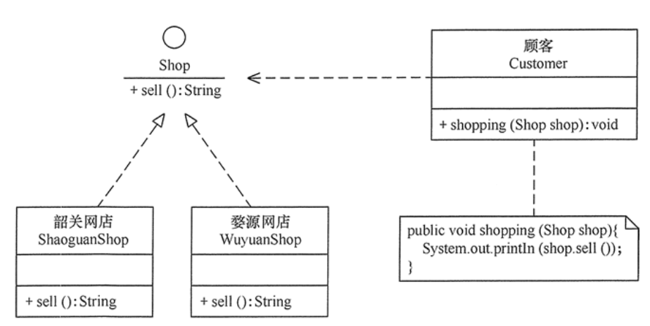

# Dependency inversion principle

## 定义

依赖倒置原则的原始定义为：高层模块不应该依赖低层模块，两者都应该依赖其抽象；抽象不应该依赖细节，细节应该依赖抽象

## 核心思想

要面向接口编程，不要面向实现编程。

## 作用

1. 可以降低类间的耦合性。
2. 可以提高系统的稳定性。
3. 可以减少并行开发引起的风险。
4. 可以提高代码的可读性和可维护性。

## 实现方法

1. 每个类尽量提供接口或抽象类，或者两者都具备。
2. 变量的声明类型尽量是接口或者是抽象类。
3. 任何类都不应该从具体类派生。
4. 使用继承时尽量遵循里氏替换原则。

## 举例——顾客购物程序

本程序反映了 “顾客类”与“商店类”的关系。商店类中有 sell() 方法，顾客类通过该方法购物以下代码定义了顾客类通过韶关网店 ShaoguanShop 购物：

```java
class Customer {
    public void shopping(ShaoguanShop shop) {
        //购物
        System.out.println(shop.sell());
    }
}
```

但是，这种设计存在缺点，如果该顾客想从另外一家商店（如婺源网店 WuyuanShop）购物，就要将该顾客的代码修改如下：

```java
class Customer {
    public void shopping(WuyuanShop shop) {
        //购物
        System.out.println(shop.sell());
    }
}
```

顾客每更换一家商店，都要修改一次代码，这明显违背了开闭原则。存在以上缺点的原因是：顾客类设计时同具体的商店类绑定了，这违背了依赖倒置原则。解决方法是：定义“婺源网店”和“韶关网店”的共同接口 Shop，顾客类面向该接口编程，其代码修改如下：

```java
class Customer {
    public void shopping(Shop shop) {
        //购物
        System.out.println(shop.sell());
    }
}
```

这样，不管顾客类 Customer 访问什么商店，或者增加新的商店，都不需要修改原有代码了。



总体程序如下：

```java
package principle;

public class DIPtest {
    public static void main(String[] args) {
        Customer wang = new Customer();
        System.out.println("顾客购买以下商品：");
        wang.shopping(new ShaoguanShop());
        wang.shopping(new WuyuanShop());
    }
}

//商店
interface Shop {
    public String sell(); //卖
}

//韶关网店
class ShaoguanShop implements Shop {
    public String sell() {
        return "韶关土特产：香菇、木耳……";
    }
}

//婺源网店
class WuyuanShop implements Shop {
    public String sell() {
        return "婺源土特产：绿茶、酒糟鱼……";
    }
}

//顾客
class Customer {
    public void shopping(Shop shop) {
        //购物
        System.out.println(shop.sell());
    }
}
```