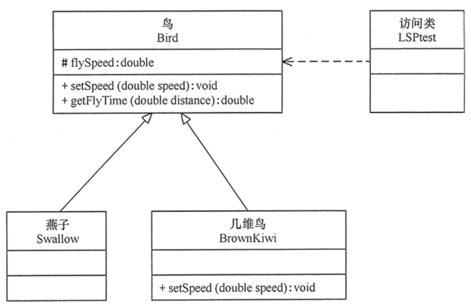
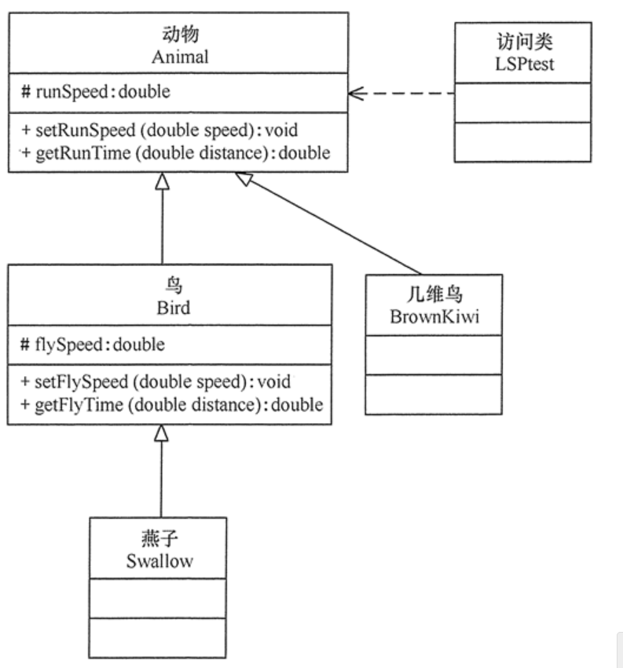

# Liskov substitution principle

## 定义

继承必须确保超类所拥有的性质在子类中仍然成立

里氏替换原则主要是告诉我们两个类之间是否是真正的父子关系需要我们斟酌，继承是一种侵入性的增加类耦合性，当父类产生了代码的修改是否会影响到子类是一个非常重要的问题，而且因为多态性的存在，如果不遵守里氏替换原则很可能在执行代码上出现错误

## 作用

1. 里氏替换原则是实现开闭原则的重要方式之一。
2. 它克服了继承中重写父类造成的可复用性变差的缺点。
3. 它是动作正确性的保证。即类的扩展不会给已有的系统引入新的错误，降低了代码出错的可能性。
4. 加强程序的健壮性，同时变更时可以做到非常好的兼容性，提高程序的维护性、可扩展性，降低需求变更时引入的风险。

## 实现方法

里氏替换原则通俗来讲就是：子类可以扩展父类的功能，但不能改变父类原有的功能。也就是说：子类继承父类时，除添加新的方法完成新增功能外，尽量不要重写父类的方法。

## 举例——几维鸟不是鸟

鸟一般都会飞行，如燕子的飞行速度大概是每小时 120 千米。但是新西兰的几维鸟由于翅膀退化无法飞行。假如要设计一个实例，计算这两种鸟飞行 300 千米要花费的时间。显然，拿燕子来测试这段代码，结果正确，能计算出所需要的时间；但拿几维鸟来测试，结果会发生“除零异常”或是“无穷大”，明显不符合预期。



```java
package principle;

public class LSPtest {
    public static void main(String[] args) {
        Bird bird1 = new Swallow();
        Bird bird2 = new BrownKiwi();
        bird1.setSpeed(120);
        bird2.setSpeed(120);
        System.out.println("如果飞行300公里：");
        try {
            System.out.println("燕子将飞行" + bird1.getFlyTime(300) + "小时.");
            System.out.println("几维鸟将飞行" + bird2.getFlyTime(300) + "小时。");
        } catch (Exception err) {
            System.out.println("发生错误了!");
        }
    }
}

//鸟类
class Bird {
    double flySpeed;

    public void setSpeed(double speed) {
        flySpeed = speed;
    }

    public double getFlyTime(double distance) {
        return (distance / flySpeed);
    }
}

//燕子类
class Swallow extends Bird {
}

//几维鸟类
class BrownKiwi extends Bird {
    public void setSpeed(double speed) {
        flySpeed = 0;
    }
}
```

几维鸟类重写了鸟类的 setSpeed(double speed) 方法，这违背了里氏替换原则。正确的做法是：取消几维鸟原来的继承关系，定义鸟和几维鸟的更一般的父类，如动物类，它们都有奔跑的能力。几维鸟的飞行速度虽然为 0，但奔跑速度不为 0，可以计算出其奔跑 300 千米所要花费的时间。



