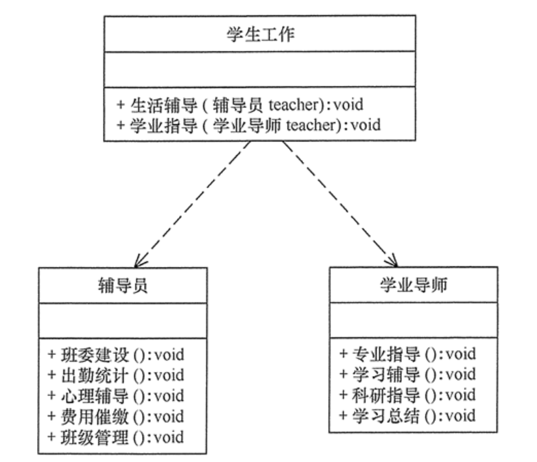

# Single responsibility principle

## 定义

单一职责原则规定每个模块、类或函数都应该对软件的单一责任提供功能，并且该责任应该完全由类封装。它的所有服务都应严格配合这一责任。换句话说，单一职责原则规定一个类应该有且仅有一个引起它变化的原因，否则类应该被拆分。

## 优点

1. 降低类的复杂度。一个类只负责一项职责，其逻辑肯定要比负责多项职责简单得多。
2. 提高类的可读性。复杂性降低，自然其可读性会提高。
3. 提高系统的可维护性。可读性提高，那自然更容易维护了。
4. 变更引起的风险降低。变更是必然的，如果单一职责原则遵守得好，当修改一个功能时，可以显著降低对其他功能的影响。

## 实现方法

单一职责原则是最简单但又最难运用的原则，需要设计人员发现类的不同职责并将其分离，再封装到不同的类或模块中。而发现类的多重职责需要设计人员具有较强的分析设计能力和相关重构经验。

## 举例——大学学生工作管理程序

分析：大学学生工作主要包括学生生活辅导和学生学业指导两个方面的工作，其中生活辅导主要包括班委建设、出勤统计、心理辅导、费用催缴、班级管理等工作，学业指导主要包括专业引导、学习辅导、科研指导、学习总结等工作。如果将这些工作交给一位老师负责显然不合理，正确的做 法是生活辅导由辅导员负责，学业指导由学业导师负责。

>*单一职责同样也适用于方法。一个方法应该尽可能做好一件事情。如果一个方法处理的事情太多，其颗粒度会变得很粗，不利于重用。*