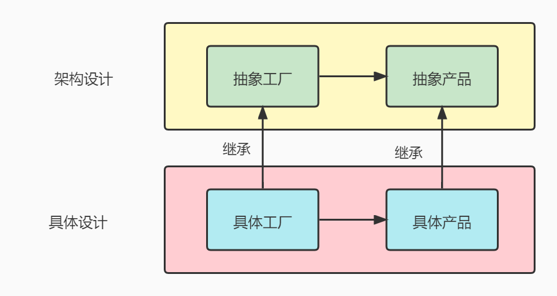

# 工厂方法模式

## 定义

工厂方法模式(Factory Method Pattern)，也叫虚拟构造器(Virtual Constructor)模式或者多态工厂(Polymorphic Factory)模式，它属于类创建型模式。在工厂方法模式中，工厂父类负责定义创建产品对象的公共接口，而工厂子类则负责生成具体的产品对象，这样做的目的是将产品类的实例化操作延迟到工厂子类中完成，即通过工厂子类来确定究竟应该实例化哪一个具体产品类。

## 适用场景

1. 一个类不知道它所需要的对象的类：在工厂方法模式中，客户端不需要知道具体产品类的类名，只需要知道所对应的工厂即可，具体的产品对象由具体工厂类创建；客户端需要知道创建具体产品的工厂类。

2. 一个类通过其子类来指定创建哪个对象：在工厂方法模式中，对于抽象工厂类只需要提供一个创建产品的接口，而由其子类来确定具体要创建的对象，利用面向对象的多态性和里氏代换原则，在程序运行时，子类对象将覆盖父类对象，从而使得系统更容易扩展。将创建对象的任务委托给多个工厂子类中的某一个，客户端在使用时可以无须关心是哪一个工厂子类创建产品子类，需要时再动态指定，可将具体工厂类的类名存储在配置文件或数据库中。

## 优缺点

### 优点

在工厂方法模式中，工厂方法用来创建客户所需要的产品，同时还向客户隐藏了哪种具体产品类将被实例化这一细节，用户只需要关心所需产品对应的工厂，无须关心创建细节，甚至无须知道具体产品类的类名。

基于工厂角色和产品角色的多态性设计是工厂方法模式的关键。它能够使工厂可以自主确定创建何种产品对象，而如何创建这个对象的细节则完全封装在具体工厂内部。

工厂方法模式之所以又被称为多态工厂模式，是因为所有的具体工厂类都具有同一抽象父类。

使用工厂方法模式的另一个优点是在系统中加入新产品时，无须修改抽象工厂和抽象产品提供的接口，无须修改客户端，也无须修改其他的具体工厂和具体产品，而只要添加一个具体工厂和具体产品就可以了。这样，系统的可扩展性也就变得非常好，完全符合“开闭原则”。

### 缺点

在添加新产品时，需要编写新的具体产品类，而且还要提供与之对应的具体工厂类，系统中类的个数将成对增加，在一定程度上增加了系统的复杂度，有更多的类需要编译和运行，会给系统带来一些额外的开销。

由于考虑到系统的可扩展性，需要引入抽象层，在客户端代码中均使用抽象层进行定义，增加了系统的抽象性和理解难度，且在实现时可能需要用到DOM、反射等技术，增加了系统的实现难度。

## 工厂方法模式中的角色



### 抽象工厂

也就是开题这个例子中的总工厂，抽象工厂是所有具体工厂的基类，在抽象工厂角色中，声明了生成产品实例的方法。抽象工厂的目的是为了让实例的生成不再通过new，而是通过生成实例的专用方法

### 具体工厂

也就是开题这个例子中的制作小米电视的工厂，是抽象工厂的子类，实现抽象工厂中定义的生成产品实例的方法。

### 抽象产品

也就是开题这个例子中的电视产品，是一个总的抽象产品，定义了一个产品的一系列方法。

### 具体产品

也就是开题这个例子中的小米电视，是一个具体的产品，实现抽象产品的方法。

## 火锅订单系统

### HotPot 

```java
public abstract class HotPot {
    //肉
    protected String meat;
    //菜
    protected String greens;
    //底料
    protected String material;
    //配菜
    public abstract String prepare();
    //套餐
    public void display() {
        System.out.println(this.meat + this.greens + this.material);
    }
}
```

### OneHotPot

```java
public class OneHotPot extends HotPot {
    //套餐内容
    public OneHotPot() {
        this.meat = "oneMeat";
        this.greens = "oneGreens";
        this.material = "oneMaterial";
    }
    //自定义配菜
    public String prepare() {
        return this.getClass() + "prepare----------";
    }
}
```

### TwoHotPot

```java
public class TwoHotPot extends HotPot{
    //套餐内容
    public TwoHotPot() {
        this.meat = "twoMeat";
        this.greens = "twoGreens";
        this.material = "twoMaterial";
    }
    //自定义配菜
    public String prepare() {
        return this.getClass() + "prepare----------";
    }
}
```

### HotPotStore

```java
public class HotPotStore {
    //组合工厂对象
    private HotPotFactory hotPotFactory;

    //初始化工厂对象
    public HotPotStore(HotPotFactory hotPotFactory) {
        this.hotPotFactory = hotPotFactory;
    }
    //订单
    public void orderHotPot(int type) {
        HotPot hotPot = this.hotPotFactory.createHotPot(type);
        hotPot.prepare();
        hotPot.display();
    }

}
```

### HotPotFactory

```java
public class HotPotFactory {
    //对象类型
    public static final int ONE_TYPE = 1;
    public static final int TW0_TYPE = 2;
    //对象逻辑
    public HotPot createHotPot(int type) {
        if (type == ONE_TYPE) {
            return new OneHotPot();
        } else if (type == TW0_TYPE) {
            return new TwoHotPot();
        } else {
            return null;
        }
    }
}
```